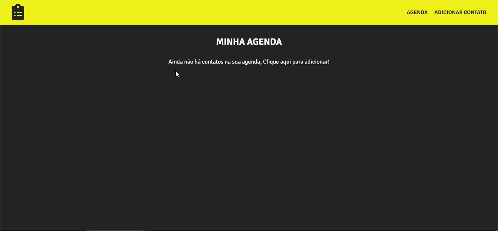
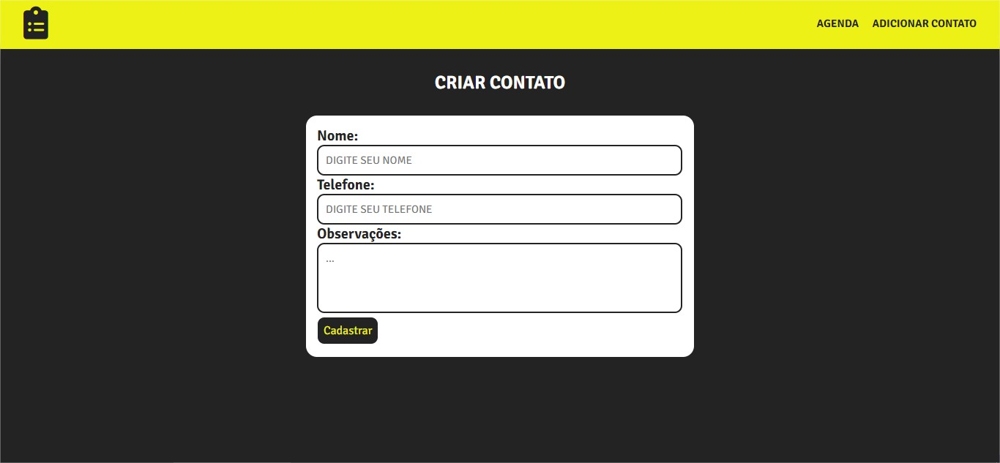
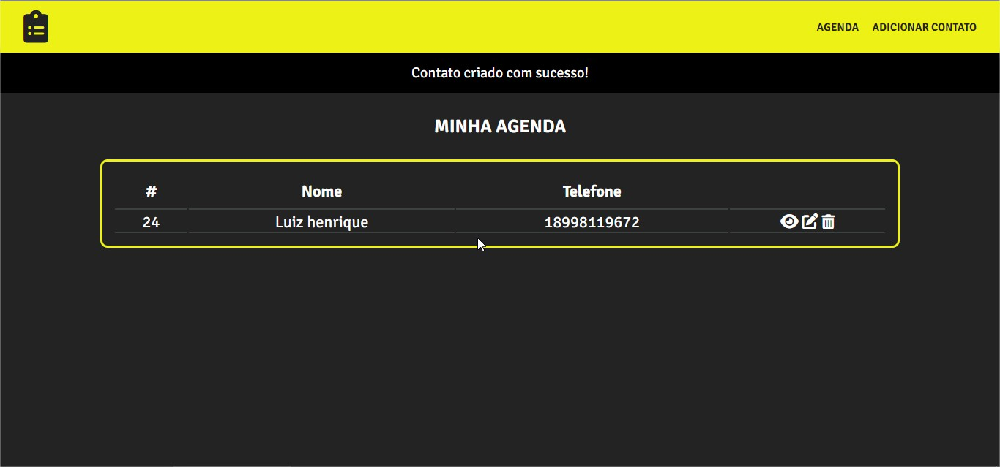
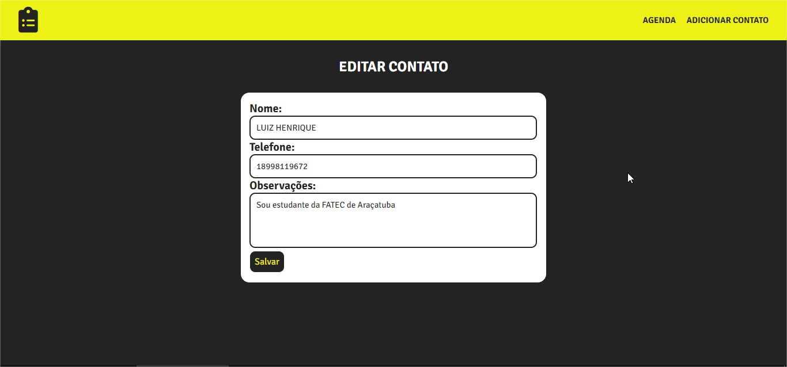
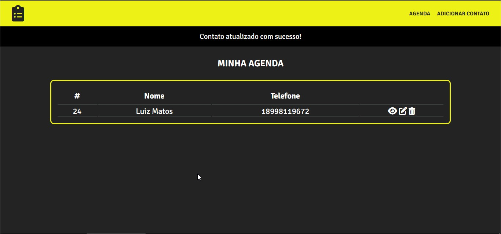

# Agenda

Projeto criado durante o curso do Professor Matheus Battisti, PHP do Zero a Maestria!

<h1>Imagens do Projeto!</h1>

<strong>Pagina inicial sem contatos cadastrados

<strong>Pagina de criar contato

<strong>Pagina inicial com contato cadastrado

<strong>Pagina de editar contato

<strong>Contato editado

 OBS: Existe também a funcionalidade de apagar contato!
